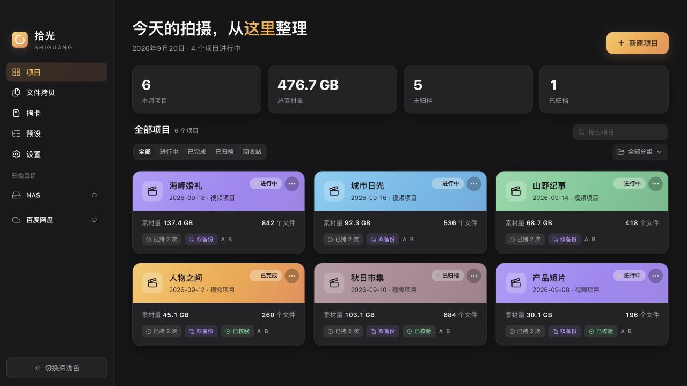
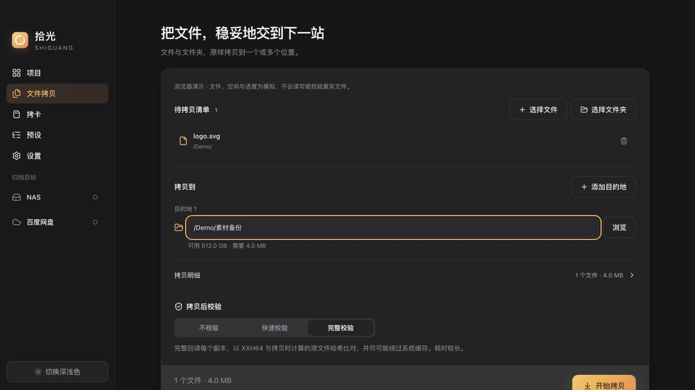

[简体中文](./README.md) · [繁體中文](./README.zh-TW.md) · [English](./README.en.md) · [日本語](./README.ja.md)

<h1 align="center">Shiguang 拾光</h1>

<strong>Bring your footage home with confidence.</strong>

A Mac media workspace for photographers and video teams. Ingest camera cards, files, and folders; write to multiple destinations; verify each copy; and keep searchable project and task reports.

<a href="https://github.com/Sorasukiawa/shiguang/releases/download/v0.2.1/Shiguang_0.2.1_aarch64.dmg"><strong>Download v0.2.1 · Apple Silicon Mac</strong></a> · <a href="https://getshiguang.pages.dev/guides/">User guides</a> · <a href="https://github.com/Sorasukiawa/shiguang/releases/tag/v0.2.1">What's new</a>

Free beta · 简体中文 / 繁體中文 / English / 日本語 · Light and dark themes

*Illustrative projects and data, rendered from the Shiguang UI in an isolated browser. This image does not establish native file-operation testing.*

## A clear path for every shoot

| Start with | What Shiguang does | What you can check |
| --- | --- | --- |
| **Camera card ingest** | Finds photo, video, and audio media; organizes by project, shoot date, and camera; reads the source once while writing to a working disk and a second backup | Copy and verification results for each destination, card history, and retry status |
| **File and folder copy** | Takes files from Finder or a picker, preserves folder structure, and writes to one or more destinations | Source list, capacity preflight, transfer results, and retry for incomplete copies |
| **Project media import** | Adds existing media to a chosen project and maps photos, video, audio, and project files into its folders | Import location, project record, and task result |
| **Project archive** | Archives to a local or network destination while retaining the project record; does not automatically delete local media | Archive task, available verification result, and report |

Shiguang **never overwrites existing files**. Multi-destination results are tracked separately. After an interruption or disconnect, it checks destination identity and capacity again before retrying incomplete copies.

### File copy

*UI workflow demonstration for a feature introduced in v0.2.0. Paths and files are examples.*

### Task reports

Find results by project, date, type, and status; export an offline HTML or multipage PDF report. Missing fields in older records are marked as unknown rather than treated as success.

*v0.2.1 report example; all content is synthetic.*

## Get started

1. Download the **Apple Silicon Mac** DMG above. There is no public Intel Mac or Windows installer. Check your chip in **Apple menu → About This Mac**.
2. Open the DMG and drag Shiguang into Applications. If macOS blocks the first launch, verify the app in **System Settings → Privacy & Security** and choose **Open Anyway**. You do not need to disable Gatekeeper.
3. Add a source, project, and destinations. Review capacity and verification before starting. Keep the original card and another reliable backup for important media; format the card only after checking the copies.

This is a **free beta** with an ad-hoc signature, without Apple Developer ID signing or notarization. Download only from [this repository's Releases](https://github.com/Sorasukiawa/shiguang/releases). Active ingest, file-copy, or archive tasks block installation of an update.

## Current release · v0.2.1

- Fast verification fully rereads each destination file and compares XXH64. Full verification also independently rereads the source. Results disclose when the device cannot bypass the system cache.
- Ingest, file-copy, project-import, and archive tasks now have searchable, exportable reports. Interrupted records are no longer shown as successful.
- Storage preflight on a slow device no longer monopolizes the database connection used by other pages.

[Full release notes](https://github.com/Sorasukiawa/shiguang/releases/tag/v0.2.1) · [All versions](./VERSIONS.md)

Verification, storage, and network folders

- **No verification** only relies on write errors and is unsuitable for important media. **Fast verification** rereads each destination file and compares its XXH64 with the hash computed from the source during copying. **Full verification** independently rereads every source file too. XXH64 detects content differences; it is not a cryptographic signature. Spot-check critical media even after verification passes.
- APFS is recommended for working, second-backup, and archive destinations. ExFAT can be a destination only if it passes Shiguang's safety capability check; otherwise writing is refused before it starts. An ExFAT camera card can be a read-only source. Shiguang does not require formatting existing media.
- Scanning, copying, verification, and project records are local by default; Shiguang does not upload photos or video to its own server. If you choose a NAS or third-party sync folder, the operating system or service handles subsequent network transfer or sync. Check disconnect and sync behavior in your own environment.

## Help and feedback

[Website](https://getshiguang.pages.dev/) · [Guides](https://getshiguang.pages.dev/guides/) · [Report an issue](https://github.com/Sorasukiawa/shiguang/issues)

Include the app version, macOS version and chip, source and destination formats, reproduction steps, and complete error text. Redact project names and paths in screenshots. **Do not upload original media or client information.**

This repository hosts installers, documentation, release history, and feedback. **It does not contain the Shiguang app source code or grant an open-source or redistribution license.** GitHub's automatic Source code archives contain only this repository's public materials; they are not app installers.
