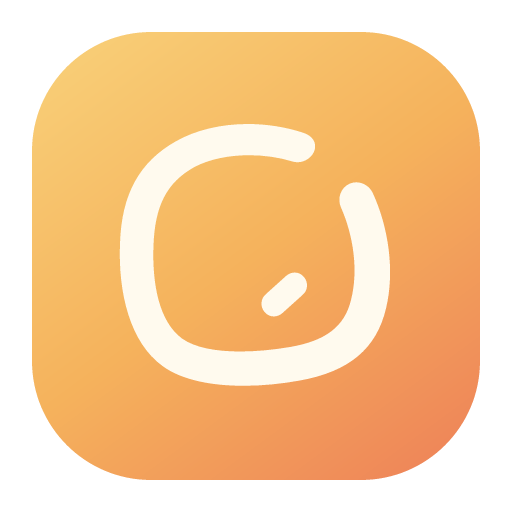
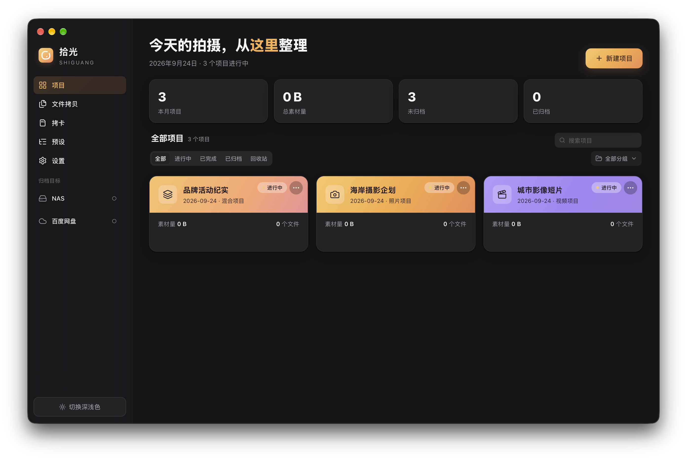
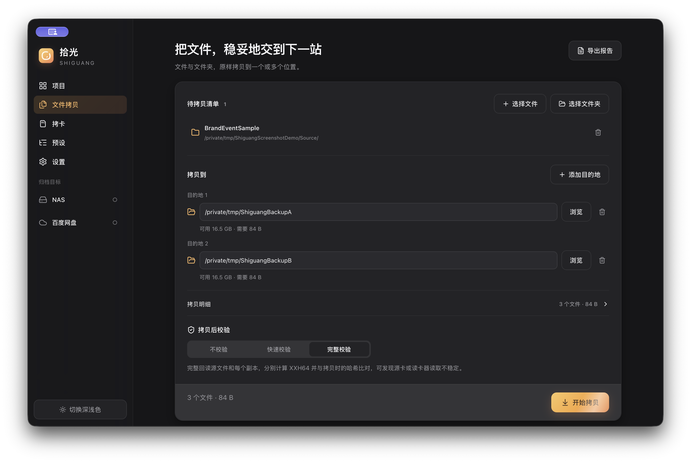
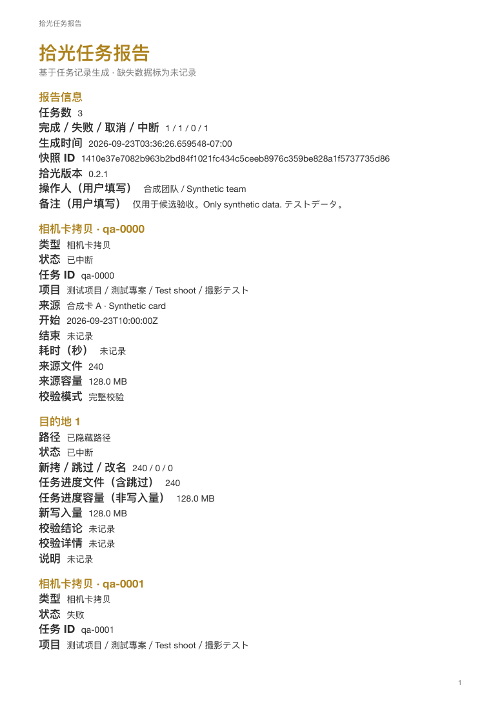

[简体中文](./README.md) · [繁體中文](./README.zh-TW.md) · [English](./README.en.md) · [日本語](./README.ja.md)

<h1 align="center">拾光 Shiguang</h1>

<strong>撮影素材を、確かめながら持ち帰る。</strong>

写真家と映像チームのための Mac 用素材ワークスペース。メモリーカード、ファイル、フォルダーから素材を取り込み、複数の保存先へ書き込み、コピーを検証して、検索できるプロジェクト・作業レポートを残します。

<a href="https://github.com/Sorasukiawa/shiguang/releases/download/v0.2.1/Shiguang_0.2.1_aarch64.dmg"><strong>v0.2.1 をダウンロード · Apple Silicon Mac</strong></a> · <a href="https://getshiguang.pages.dev/guides/">使い方</a> · <a href="https://github.com/Sorasukiawa/shiguang/releases/tag/v0.2.1">更新内容</a>

無料ベータ版 · 简体中文 / 繁體中文 / English / 日本語 · ライト／ダークテーマ

*v0.2.1 Apple Silicon Mac のネイティブウィンドウを撮影。プロジェクト名とデータは隔離したデモ環境のサンプルです。*

## 撮影素材の流れを明確に

| 開始する作業 | 拾光でできること | 確認できる結果 |
| --- | --- | --- |
| **カード取り込み** | 写真・動画・音声を検出し、プロジェクト、撮影日、カメラごとに整理。元カードを一度読み、作業用と二つ目のバックアップ先へ同時に書き込み | 保存先ごとのコピー・検証結果、カード履歴、再試行の状態 |
| **ファイル／フォルダーのコピー** | Finder からドラッグ、または選択。階層を保持して一つ以上の保存先へコピー | 元ファイル一覧、空き容量の事前確認、転送結果、未完了分の再試行 |
| **プロジェクトへの素材追加** | 既存素材を指定プロジェクトへ追加し、写真・動画・音声・制作ファイルなどに振り分け | 追加先、プロジェクト記録、作業結果 |
| **プロジェクトのアーカイブ** | ローカルまたはネットワーク先へアーカイブ。プロジェクト記録を保持し、ローカル素材を自動削除しない | アーカイブ作業、取得できた検証結果、レポート |

拾光は**既存ファイルを上書きしません**。複数の保存先は別々に結果を記録します。中断や切断の後は保存先の識別情報と空き容量を再確認し、未完了のコピーだけを再試行します。

### ファイルコピー

*v0.2.1 Apple Silicon Mac のネイティブウィンドウを撮影。パスとファイルは隔離したデモ環境のサンプルです。*

### 作業レポート

プロジェクト、日付、種類、状態で結果を探し、オフライン HTML または複数ページの PDF に書き出せます。過去の記録にない項目は「未記録」と示し、成功と推定しません。

*v0.2.1 のレポート例。内容はすべて合成データです。*

## 使い始める

1. 上の **Apple Silicon Mac** 用 DMG をダウンロードしてください。Intel Mac と Windows 向けの公開インストーラーはありません。チップは ** → この Mac について** で確認できます。
2. DMG を開き、拾光を「アプリケーション」へドラッグします。macOS が初回起動を止めた場合は、**システム設定 → プライバシーとセキュリティ** でアプリを確認し、「このまま開く」を選びます。Gatekeeper を無効にする必要はありません。
3. 元データ、プロジェクト、保存先を追加し、容量と検証方法を確認してから開始してください。大切な素材は元カードと別の信頼できるバックアップを残し、コピー確認後にカードを初期化してください。

現在は**無料ベータ版**です。ad-hoc 署名を使用しており、Apple Developer ID 署名と公証はありません。[このリポジトリの Releases](https://github.com/Sorasukiawa/shiguang/releases) からのみ入手してください。カード取り込み、ファイルコピー、アーカイブの実行中は更新をインストールできません。

## 最新版 · v0.2.1

- 簡易検証では保存先ファイルをすべて読み直して XXH64 を比較します。完全検証では元ファイルも独立して読み直します。システムキャッシュを回避できない機器では、その旨を結果に表示します。
- 取り込み、ファイルコピー、プロジェクトへの追加、アーカイブの結果を検索・書き出しできます。中断した記録を成功として表示しません。
- 低速ストレージの事前確認待ちが、ほかの画面のデータベース接続を占有しなくなりました。

[詳しいリリースノート](https://github.com/Sorasukiawa/shiguang/releases/tag/v0.2.1) · [すべてのバージョン](./VERSIONS.md)

検証、保存先、ネットワークフォルダー

- **検証なし**は書き込み時のエラーだけを確認するため、大切な素材には適しません。**簡易検証**は各保存先を読み直し、コピー時に計算した元ファイルの XXH64 と比較します。**完全検証**ではさらにすべての元ファイルを独立して読み直します。XXH64 は内容の差を調べるもので、暗号学的な署名ではありません。検証後も重要な素材を目視確認してください。
- 作業用、第二バックアップ、アーカイブ先には APFS を推奨します。ExFAT を保存先に使う場合は安全機能の確認が必要で、確認できなければ書き込み前に拒否します。ExFAT のカメラカードは読み取り専用の元データとして使えます。既存メディアの初期化は要求しません。
- 素材の走査・コピー・検証とプロジェクト記録は既定でローカル処理され、拾光のサーバーへ写真や動画をアップロードしません。NAS や外部同期フォルダーを選んだ場合、その後の転送・同期は OS または各サービスが担当します。切断や同期の動作は利用環境で確認してください。

## ヘルプとフィードバック

[公式サイト](https://getshiguang.pages.dev/) · [使い方](https://getshiguang.pages.dev/guides/) · [問題を報告](https://github.com/Sorasukiawa/shiguang/issues)

報告にはアプリと macOS のバージョン、チップ、元データと保存先の形式、再現手順、エラー全文を添えてください。画像のプロジェクト名やパスは隠し、**元の素材や顧客情報はアップロードしないでください**。

このリポジトリはインストーラー、説明、リリース履歴、フィードバックを公開します。**拾光アプリのソースコードは含まず、オープンソースライセンスや再配布の許可もありません。** GitHub が自動生成する Source code は、このリポジトリの公開資料をまとめたもので、アプリのインストーラーではありません。
