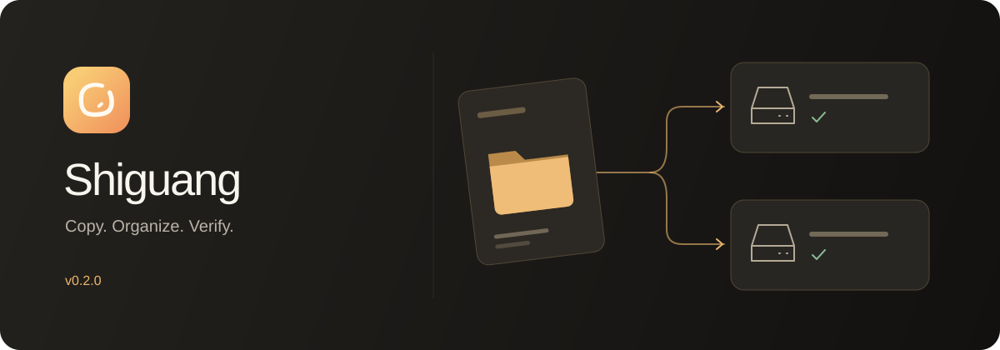

[简体中文](./README.md) | [繁體中文](./README.zh-TW.md) | [English](./README.en.md) | [日本語](./README.ja.md)

<h1 align="center">拾光 Shiguang</h1>

相机卡拷卡 · 文件拷贝 · 项目素材导入

<a href="https://github.com/Sorasukiawa/shiguang/releases/download/v0.2.0/Shiguang_0.2.0_aarch64.dmg"><strong>下载 v0.2.0 · Apple Silicon Mac</strong></a> 免费内测 · 简体中文 / 繁體中文 / English / 日本語 · 浅色与深色主题

<a href="https://getshiguang.pages.dev/">官网与交互演示</a> · <a href="https://getshiguang.pages.dev/guides/">使用指南</a> · <a href="./RELEASE_NOTES_v0.2.0.md">完整更新说明</a> · <a href="https://github.com/Sorasukiawa/shiguang/issues">问题反馈</a>

 App 界面预览 · 示例项目与数据

## 选择适合这份素材的工作流

| 你想做什么 | 在拾光里这样做 |
| --- | --- |
| **拷贝文件与文件夹** · v0.2.0 新增 | 从 Finder 拖入或选择文件，写入一个或多个目的地；保留原有层级、隐藏文件和空目录 |
| **把已有素材加入项目** · v0.2.0 新增 | 拖到项目卡片或项目详情，按照片、视频、音频、工程文件等类别映射到项目目录 |
| **从相机卡收素材** | 识别素材，按拍摄日、机位与项目预设整理；相机卡读取一次，同时写入工作盘与第二备份盘 |
| **整理并归档项目** | 用可复用模板统一目录，归档时执行完整校验、保留项目记录，不自动删除本地素材 |

### 一份来源，多个落点

### 从拖入文件，到确认结果

1. **选来源**：添加文件、文件夹或相机卡素材。
2. **看计划**：确认文件数量、总大小、目标空间、目录映射与校验方式。
3. **拷贝并检查**：查看持续显示的任务进度、完成结果与失败文件。
4. **有缺失就补齐**：重新检查目标后，只重试未完成的文件或副本。

## v0.2.0，让日常素材流转更完整

- **写入前先检查**：拦截路径重叠、目的地互相包含和同卷合计空间不足，并确认目标身份。
- **已有文件不覆盖**：同名冲突明确报告，异常半成品不被视为成功结果。
- **每个目标独立恢复**：一个目标掉线，另一个可继续；重连后只补齐缺失副本。
- **App 重启后继续恢复**：任务收据记录已完成结果，覆盖强退、磁盘写满与记录提交中断等情况。
- **APFS 目标保护**：磁盘卸载或被替换时停止对该目标写入，避免误写原挂载点背后的本机目录。
- **原有拷卡能力继续保留**：双备份、三种校验、MHL 与可读报告、防重拷、项目模板与归档。

[v0.2.0](https://github.com/Sorasukiawa/shiguang/releases/tag/v0.2.0) · [查看全部版本](https://github.com/Sorasukiawa/shiguang/releases) · [阅读 v0.2.0 完整发布说明](./RELEASE_NOTES_v0.2.0.md)

## 下载与使用前须知

仅提供 **Apple Silicon macOS 免费内测版**，Intel Mac 与 Windows 版尚未提供公开下载。可在 ** → 关于本机** 查看芯片类型。公开 v0.1.19 可在设置中检查更新；拷卡、文件拷贝或归档运行时不会安装更新。

> [!IMPORTANT]
> 当前安装包采用 ad-hoc 签名，尚无 Apple Developer ID 签名或 Apple 公证。处理重要素材时，请保留原卡及另一份可靠备份，确认副本后再格式化；不要把内测版作为唯一保障。

本版已验证的场景包括合成文件、隔离数据库、Finder 原生拖放与 APFS 镜像强制掉线；不代表所有实体 USB 设备、NAS 断连或第三方同步服务均已验证。

## 如何理解校验

- **不校验**：只依据写入过程是否报错，最快，不适合重要素材。
- **快速校验**：逐文件检查存在、可读和字节数一致，发现漏拷或明显截断。
- **完整校验**：从每个目标盘重读全部字节，重算 xxHash64 并与拷贝时的源哈希比对，适合重要拍摄或双备份流程。

xxHash64 用于检测拷贝内容是否一致，不是身份认证或加密签名。即使校验通过，也建议在格式化相机卡前人工抽查关键素材，并确认至少两份副本可用。

## macOS 首次打开

v0.2.0 尚未使用 Apple Developer ID 签名，也未经过 Apple 公证。macOS 可能因此拦截首次启动：

1. 只从 [Sorasukiawa/shiguang](https://github.com/Sorasukiawa/shiguang) 的 Releases 下载 DMG。
2. 打开 DMG，将“拾光”拖入“Applications / 应用程序”文件夹。
3. 在“应用程序”中正常打开一次；如系统拦截，先关闭提示。
4. 前往 **系统设置 → 隐私与安全性**，确认被拦截的应用是“拾光”后，选择“仍要打开”。

不需要关闭 Gatekeeper，也不要为来源不明的安装包绕过系统保护。

## 存储盘兼容性

- **APFS 是工作盘、第二备份盘和归档目标盘的推荐格式。**
- **ExFAT 也可作为目标盘，但必须先通过拾光的安全能力实测。**无法证明安全时，应用会在写入素材前拒绝，不会降级成可能覆盖文件的普通写入。
- **ExFAT 相机卡可直接作为只读素材来源**，不受目标盘安全探针限制。

APFS 与 ExFAT 的安全落盘方式不同，但都坚持不覆盖已有文件。拾光不会要求格式化来源卡或已有工作盘，请不要为试用内测版而更改唯一份素材所在介质的格式。

## 隐私与网络

- 素材扫描、拷贝、校验与项目记录默认在本机完成。
- 拾光不会将照片或视频上传到“拾光”服务器。
- 如果将 NAS 或第三方同步文件夹设为目标，后续网络传输或云端同步由对应系统或服务提供方完成。
- 开启自动更新后，应用会访问官方更新源；发现更新时只提醒，不会在拷卡或归档中自动安装。

## 反馈内测问题

请前往 [Issues](https://github.com/Sorasukiawa/shiguang/issues) 提交问题或建议。建议附上拾光版本、macOS 版本、Mac 芯片型号、来源卡与目标盘格式、复现步骤和完整错误文字。必要截图请先遮挡客户名称、项目名称和本地路径。

请不要在 Issue 中上传原始素材、客户资料、私密路径或其他敏感信息。

## 关于本仓库

这是拾光的公开主仓库，用于发布**官方安装包、使用说明、版本记录与用户反馈**。

**本仓库不包含拾光源代码，未提供开源许可证，也不构成任何源代码修改或再分发授权。**
