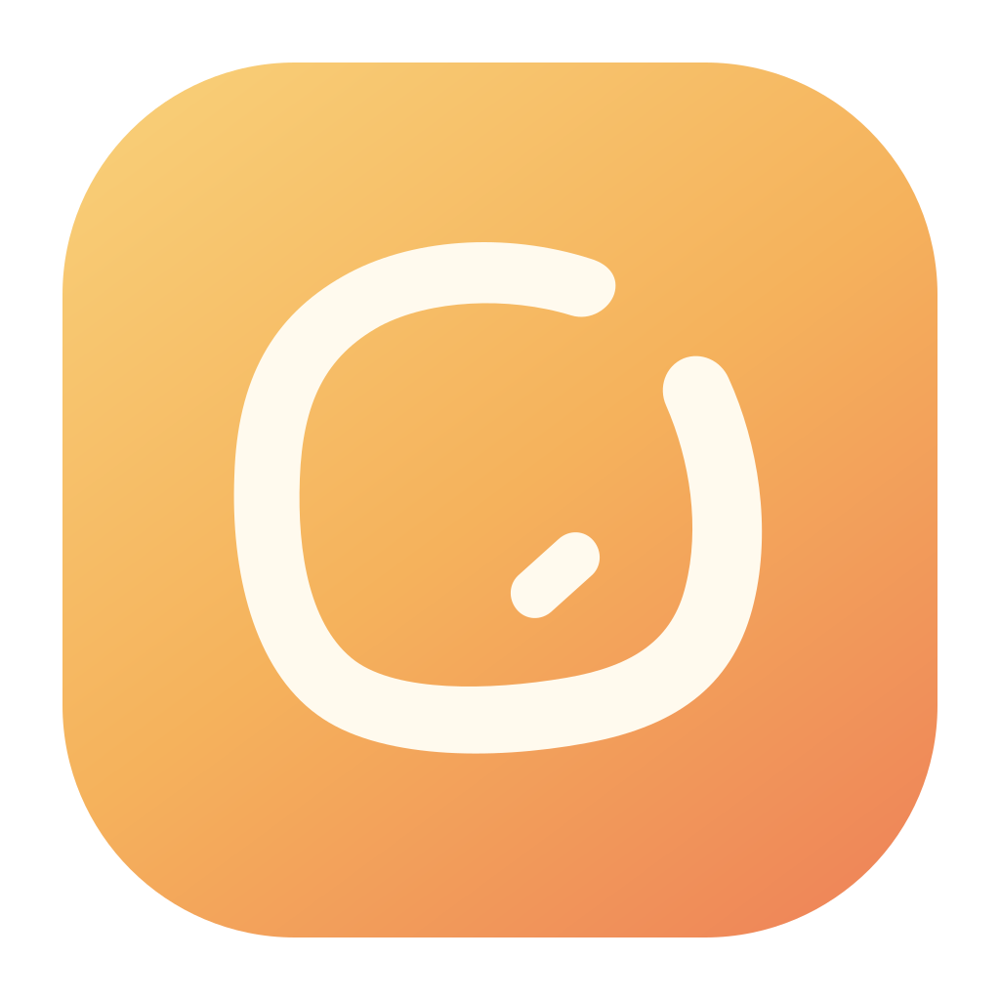

[简体中文](./README.md) | [繁體中文](./README.zh-TW.md) | [English](./README.en.md) | [日本語](./README.ja.md)

<h1 align="center">拾光 Shiguang</h1>

把每一次拷卡，变成可确认、可追溯的流程。

面向<strong>摄影师、摄像师、个人创作者及摄影摄像团队</strong>的本地拷卡、双备份、校验与项目归档工具。

> [!IMPORTANT]
> 拾光当前是**免费内测版**。处理重要素材时，请保留原始存储卡，并确认至少还有一份可靠备份后再格式化卡片。暂时不建议将内测版作为重要素材的唯一保障。

## 下载

### v0.1.16 · Apple Silicon Mac

当前公开内测包仅适用于搭载 Apple M 系列芯片的 Mac（Apple Silicon Mac）。Intel Mac 与 Windows 版尚未提供公开下载。

- [下载拾光 v0.1.16 DMG](https://github.com/Sorasukiawa/shiguang/releases/tag/v0.1.16)
- [查看全部版本](https://github.com/Sorasukiawa/shiguang/releases)

如果不确定 Mac 的芯片类型，请打开左上角 ** → 关于本机**，查看“芯片”一项。

## v0.1.16 更新内容

- 新建项目时可选择“简单存放”或“按卡分开”：可减少目录层级，也可用 R01、R02 区分每张存储卡。
- 视频、照片和混合项目的内置预设统一增加独立的 `LOGO` 素材目录。
- 拷卡页只有在明确选择项目后才准备拷贝，不再自动绑定列表中的第一个项目。
- 项目回收站名称简化为“回收站”，仍与 macOS“系统废纸篓”明确区分。
- 优化素材存放方式的切换反馈，并继续支持 macOS“减弱动态效果”。
- 已有项目继续沿用原来的目录规则；如果结构信息异常，拾光会先停止拷卡，不会猜测保存位置。

## 拾光能做什么

| 能力 | 说明 |
| --- | --- |
| 存储卡识别 | 识别常见照片、视频和音频素材，按拍摄日、机位和项目预设组织文件 |
| 安全拷卡 | 按目标盘能力选择安全落盘协议；同名文件永不覆盖，异常残留会保留并明确报错 |
| 双备份 | 相机卡只读取一次，同时写入工作盘与第二备份盘 |
| 拷贝校验 | 快速校验检查文件可读与大小；完整校验重读目标文件，并用 xxHash64 与源素材比对 |
| 报告与防重拷 | 生成 MHL 与人类可读报告，记录已成功拷贝的卡片，补拷时只处理新增或缺失文件 |
| 项目与预设 | 用可复用的目录模板创建项目，统一原片、选片、成品、音频与工程文件结构 |
| 项目归档 | 归档时执行完整校验，保留项目记录和监管链，不会自动删除本地素材 |

## 如何理解校验

- **不校验**：只依据写入过程是否报错，最快，不适合重要素材。
- **快速校验**：逐文件检查存在、可读和字节数一致，发现漏拷或明显截断。
- **完整校验**：从每个目标盘重读全部字节，重算 xxHash64 并与拷贝时的源哈希比对，适合重要拍摄或双备份流程。

xxHash64 用于检测拷贝内容是否一致，不是身份认证或加密签名。即使校验通过，也建议在格式化相机卡前人工抽查关键素材，并确认至少两份副本可用。

## macOS 首次打开

v0.1.16 尚未使用 Apple Developer ID 签名，也未经过 Apple 公证。macOS 可能因此拦截首次启动：

1. 只从 [Sorasukiawa/shiguang](https://github.com/Sorasukiawa/shiguang) 的 Releases 下载 DMG。
2. 打开 DMG，将“拾光”拖入“Applications / 应用程序”文件夹。
3. 在“应用程序”中正常打开一次；如系统拦截，先关闭提示。
4. 前往 **系统设置 → 隐私与安全性**，确认被拦截的应用是“拾光”后，选择“仍要打开”。

不需要关闭 Gatekeeper，也不要为来源不明的安装包绕过系统保护。

## 存储盘兼容性

- **APFS 是工作盘、第二备份盘和归档目标盘的推荐格式。**
- **ExFAT 也可作为目标盘，但必须先通过拾光的安全能力实测。**无法证明安全时，应用会在写入素材前拒绝，不会降级成可能覆盖文件的普通写入。
- **ExFAT 相机卡可直接作为只读素材来源**，不受目标盘安全探针限制。

APFS 与 ExFAT 的安全落盘方式不同，但都坚持不覆盖已有文件。拾光不会要求格式化来源卡或已有工作盘，请不要为试用内测版而更改唯一份素材所在介质的格式。

## 隐私与网络

- 素材扫描、拷贝、校验与项目记录默认在本机完成。
- 拾光不会将照片或视频上传到“拾光”服务器。
- 如果将 NAS 或第三方同步文件夹设为目标，后续网络传输或云端同步由对应系统或服务提供方完成。
- 开启自动更新后，应用会访问官方更新源；发现更新时只提醒，不会在拷卡或归档中自动安装。

## 反馈内测问题

请前往 [Issues](https://github.com/Sorasukiawa/shiguang/issues) 提交问题或建议。建议附上拾光版本、macOS 版本、Mac 芯片型号、来源卡与目标盘格式、复现步骤和完整错误文字。必要截图请先遮挡客户名称、项目名称和本地路径。

请不要在 Issue 中上传原始素材、客户资料、私密路径或其他敏感信息。

## 关于本仓库

这是拾光的公开主仓库，用于发布**官方安装包、使用说明、版本记录与用户反馈**。

**本仓库不包含拾光源代码，未提供开源许可证，也不构成任何源代码修改或再分发授权。**
